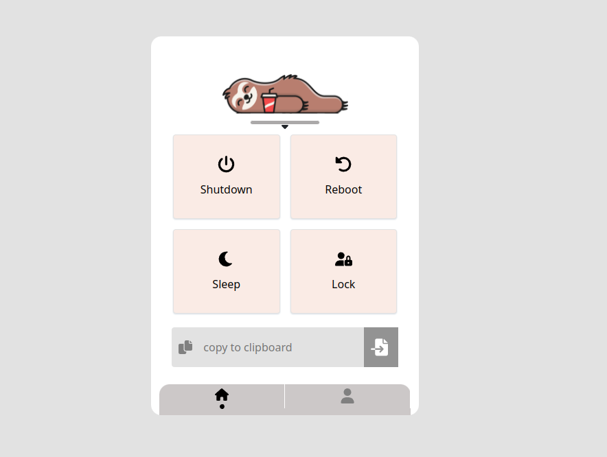

# 🦥 Lazy Helper !

### A simple interface to help lazy people like me to shut down/reboot/sleep/lock/etc. their computer remotely.



## - USAGE

#### If you're a lazy guy, like me. or a busy one, you may leave your PC on, when you're going to sleep, or going to watch a movie on TV.
#### There you are ! This is the solution you're looking for :)

#### Just install and run LazyHelper and after that you're able to shut down your linux PC with your mobile !

# - Installation

```shell
git clone https://github.com/mehdiirh/LazyHelper.git
cd LazyHelper
python -m venv venv
pip install -r requirements.txt 
source venv/bin/activate
```

Then, generate a SECRET_KEY for your project by:

```shell
python -c 'from django.core.management.utils import get_random_secret_key; print(get_random_secret_key())'
```

You'll see something like `640ivxu...2k7w6%%` as output. copy it and replace `LazyHelper/settings.py` (line 24) with it:

```python
# settings.py

...

22:
23: # SECURITY WARNING: keep the secret key used in production secret!
> 24: SECRET_KEY = 'DJANGO_INSECURE(`-._!$(#)$!===*YOUR_SECRET_KEY*===!$(#)$!*_.-`)'
    # ^^^^ PASTE IT HERE
25:
26: # SECURITY WARNING: don't run with debug turned on in production!
27: DEBUG = True
28:

...
```

### Now you can run your LazyHelper:
```shell
./manage.py runserver 0.0.0.0:8081
```
 Connect your phone and PC to same network and access it from your PC local ip address (192.168.* . *)

## - [Optional] Set host name 
```shell
sudo nano /etc/hosts
```

Add this line after `127.0.0.1    localhost`:
```shell
127.0.0.1    <your-host-name>  # like: mehdi
```

Execute this command:
```shell
hostnamectl set-hostname <your-host-name>
```

Reboot!

Now you can access your PC from your-host-name.local ( like: mehdi.local) from any device on your network

# - Daemonize 
```shell
sudo nano /etc/systemd/system/LazyHelper.service
```

 **Edit** this service based on your configs, then hit Ctrl+X and Enter to save
```shell
[Unit]
Description=LazyHelper
After=network.target

[Service]
WorkingDirectory=  # Like: /home/mehdi/python/projects/LazyHelper
ExecStart= # Like: /home/mehdi/python/projects/LazyHelper/venv/bin/python manage.py runserver 0.0.0.0:81
Restart=always

[Install]
WantedBy=multi-user.target

```

 Execute:
```shell
sudo systemctl enable LazyHelper
sudo systemctl start LazyHelper
```

### Done !

---

### Your Pull Requests are so welcome !
Currently, I have no idea how to make this work on Windows. If you know, please submit a PR.

Also, any UI/UX improvements are welcome

### - [Telegram](https://t.me/PythonUnion)
